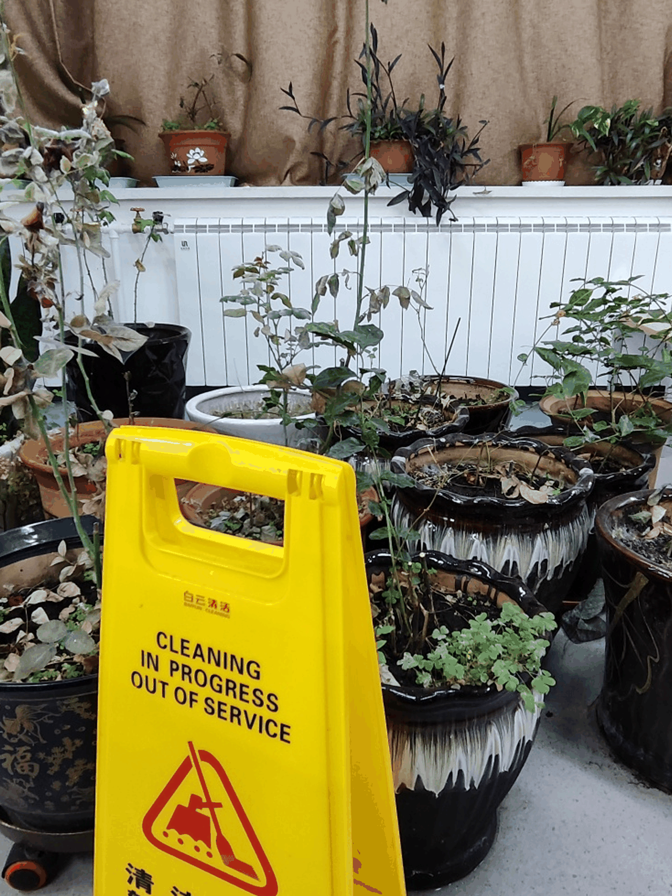
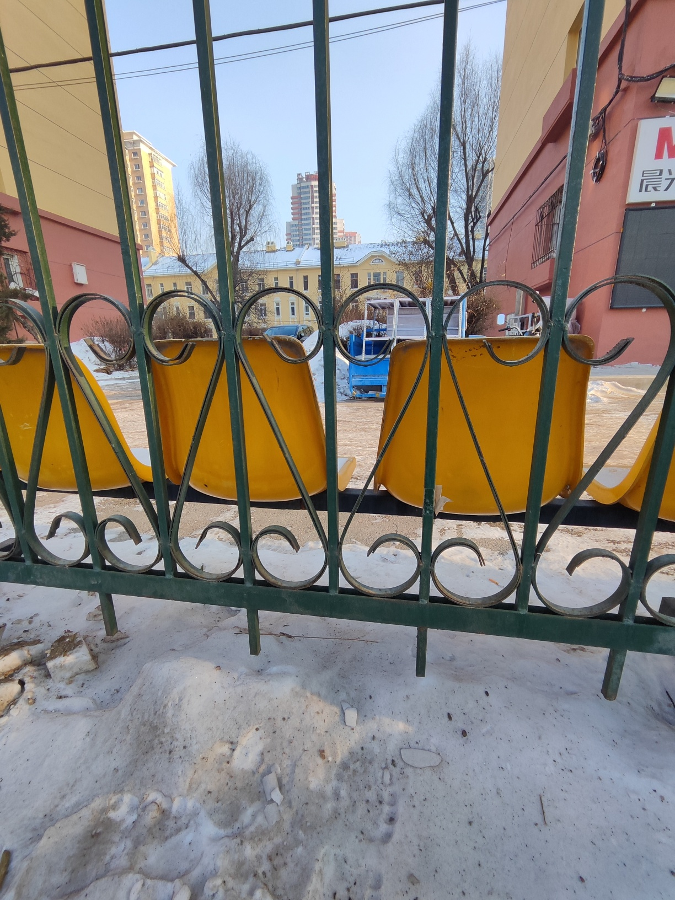
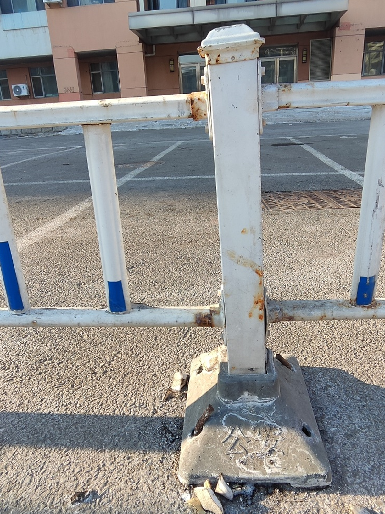
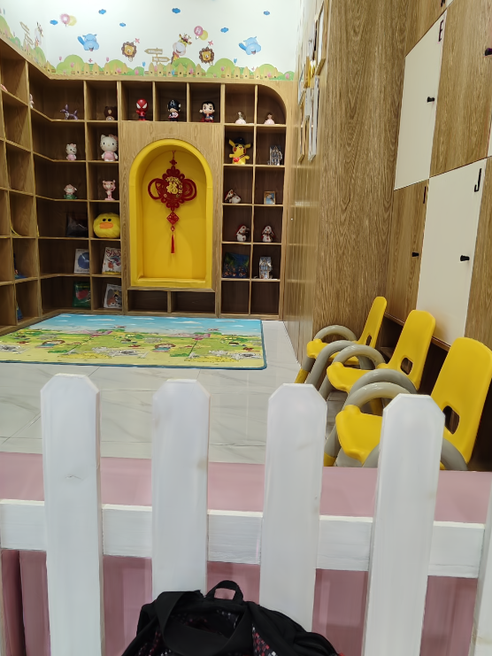

<h1>Dual-Camera Smooth Zoom on Mobile Phones</h1>

<h2>Dual-Camera Non-Smooth Zoom</h2>

<table>
   <colgroup>
    <col style="width: 25%;">
    <col style="width: 25%;">
    <col style="width: 25%;">
    <col style="width: 25%;">
  </colgroup>
  <!-- <tr> 
     <td>
          
   Ultra-Wide-Angle Image (x0.6)    

    </td>
     <td>
          
Cropped Ultra-Wide-Angle Image (x0.6)

    </td>
     <td>
          
    Wide-Angle Image (x0.6)          

    </td>
     <td>
          
UCamera Swiching (x0.9->x1.0)

    </td>
  </tr> -->
  <tr>
    <td>
       
    </td>
    <td>
      
    </td>
    <td>
      
    </td>
    <td>
      
    </td>
  </tr>

  <tr>
    <td>
       
    </td>
    <td>
      
    </td>
    <td>
      
    </td>
    <td>
      
    </td>
  </tr>

  <tr>
    <td>
       
    </td>
    <td>
      
    </td>
    <td>
      
    </td>
    <td>
      
    </td>
  </tr>

  <tr>
    <td>
       
    </td>
    <td>
      
    </td>
    <td>
      
    </td>
    <td>
      
    </td>
  </tr>
</table>

<h2>Dual-camera Smooth Zoom</h2>
<table>

   <colgroup>
    <col style="width: 33%;">
    <col style="width: 33%;">
    <col style="width: 33%;">
  </colgroup>

  <tr> 
     <td>
          
Ultra-Wide-Angle Image (x0.6)

    </td>
     <td>
          
Wide-Angle Image (x1.0)

    </td>
     <td>
          
Dual-Camera Zoom (x0.6->x1.0)

    </td>
  </tr>
  <tr>
    <td>
       
    </td>
    <td>
      
    </td>
    <td>
      
    </td>
  </tr>

  <tr>
    <td>
       
    </td>
    <td>
      
    </td>
    <td>
      
    </td>
  </tr>

  <tr>
    <td>
       
    </td>
    <td>
      
    </td>
    <td>
      
    </td>
  </tr>

  <tr>
    <td>
       
    </td>
    <td>
      
    </td>
    <td>
      
    </td>
  </tr>

</table>

