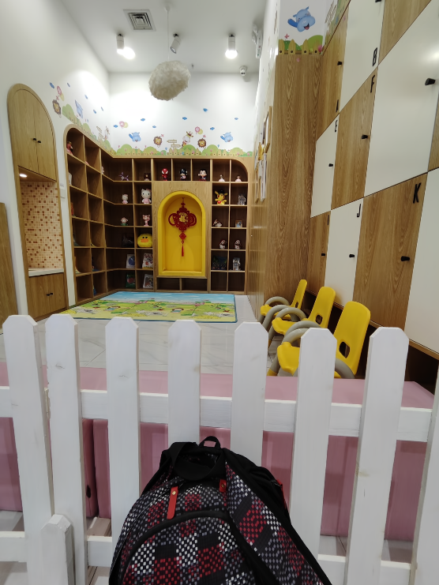

<h1>Dual-Camera Smooth Zoom on Mobile Phones</h1>

<h2>(a) Existing dual-camera zoom</h2>

<h3>
Existing dual-camera zoom. For zooming between Ultra-Wide-Angle (UW) and Wide-Angle (W) cameras (i.e., from ×0.6 to ×1.0), smartphones (e.g., Xiaomi, OPPO, and vivo) generally crop out the specific area from the UW image, and scale the image up to the dimensions of the original. When the zoom factor changes from 0.9 to 1.0, the lens has to switch from UW to W, where notable geometric content and image color jump happen in the preview.
</h3>

<table>
   <colgroup>
    <col style="width: 25%;">
    <col style="width: 25%;">
    <col style="width: 25%;">
    <col style="width: 25%;">
  </colgroup>
  <tr> 
     <td>
          
UW Image (x0.6)    

    </td>
     <td>
          
UW Image (x0.9)

    </td>
     <td>
          
Camera Swiching (x0.9->x1.0)

    </td>
     <td>
          
W Image (x0.6)

    </td>
  </tr>
  <tr>
    <td>
       
    </td>
    <td>
      
    </td>
    <td>
      
    </td>
    <td>
      
    </td>
  </tr>

  <tr>
    <td>
       
    </td>
    <td>
      
    </td>
    <td>
      
    </td>
    <td>
      
    </td>
  </tr>

  <tr>
    <td>
       
    </td>
    <td>
      
    </td>
    <td>
      
    </td>
    <td>
      
    </td>
  </tr>

  <tr>
    <td>
       
    </td>
    <td>
      
    </td>
    <td>
      
    </td>
    <td>
      
    </td>
  </tr>
</table>

<h2>(b) Dual-camera Smooth Zoom</h2>

<h3>We introduce dual-camera smooth zoom (DCSZ) task, aiming to achieve a fluid zoom preview.
some smooth zoom sequences rendered from our ZoomGS are provided below.
</h3>
<table>

   <colgroup>
    <col style="width: 33%;">
    <col style="width: 33%;">
    <col style="width: 33%;">
  </colgroup>

  <tr> 
     <td>
          
UW Image (x0.6)

    </td>
     <td>
          
W Image (x1.0)

    </td>
     <td>
          
Dual-Camera Smooth Zoom (x0.6->x1.0)

    </td>
  </tr>
  <tr>
    <td>
       
    </td>
    <td>
      
    </td>
    <td>
      
    </td>
  </tr>

  <tr>
    <td>
       
    </td>
    <td>
      
    </td>
    <td>
      
    </td>
  </tr>

  <tr>
    <td>
       
    </td>
    <td>
      
    </td>
    <td>
      
    </td>
  </tr>

  <tr>
    <td>
       
    </td>
    <td>
      
    </td>
    <td>
      
    </td>
  </tr>

</table>

